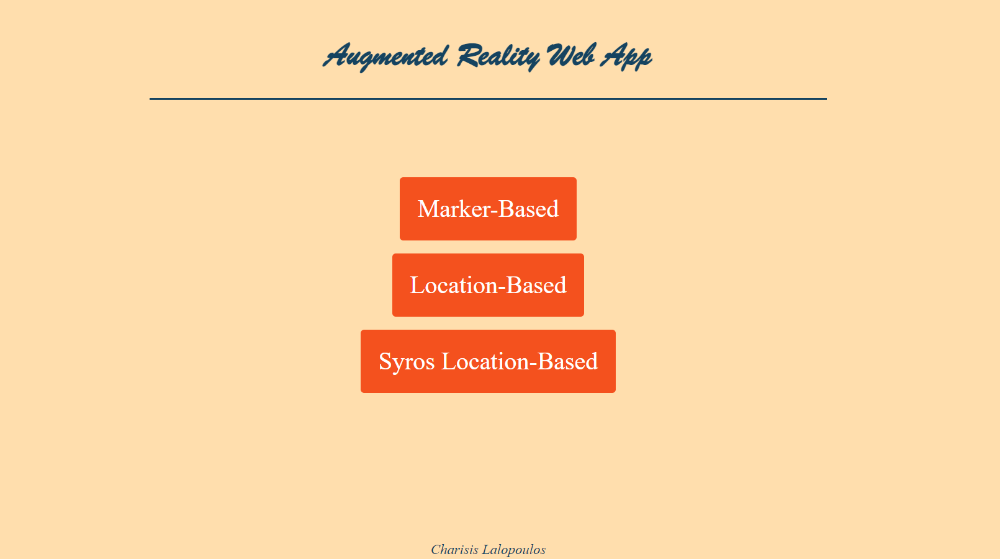
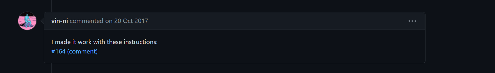
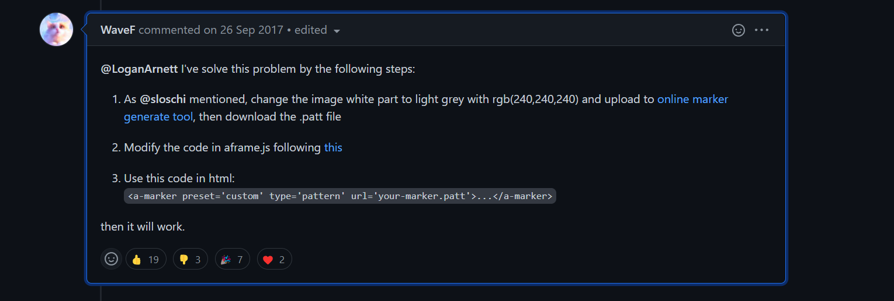
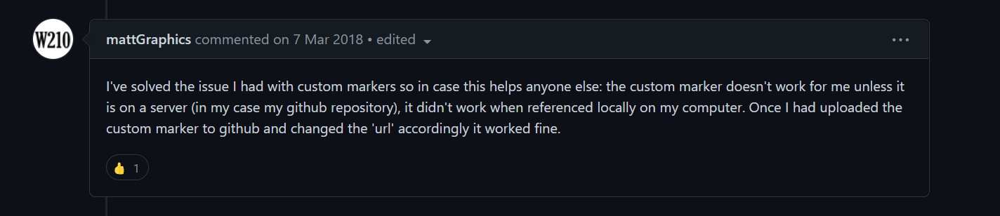
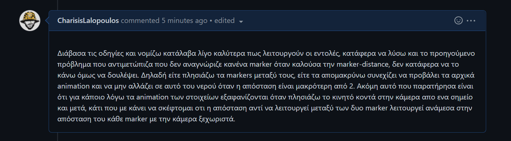
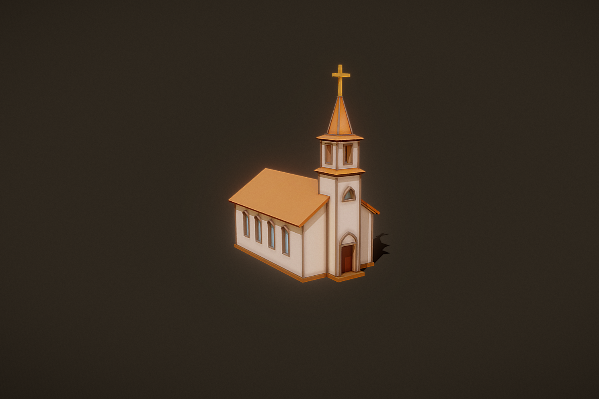

# Lesson: Interaction Design

### First and Last Name: Charisis Lalopoulos
### University Registration Number: dpsd19064
### GitHub Personal Profile: [CharisisLalopoulos](https://github.com/CharisisLalopoulos)
### Augmented Reality Personal Repository: https://charisislalopoulos.github.io/Augmented-Reality/

# Introduction

# Summary

# 1st Deliverable
Αρχικά ξεκίνησα με την εισαγωγή των υπόλοιπων αντικειμένων στην σκηνή όταν η κάμερα αναγνωρίζει το "hiro" (σφαίρα & κύλινδρος), για τα οπόια βρήκα τον κώδικα στο [A-Frame School](https://aframe.io/aframe-school/#/4/1) > [Glitch](https://glitch.com/~aframe-school-position) . Έπειτα έκανα τις αισθητικές αλλαγές όσων αφορά την θέση, το μέγεθος και τα χρώματα, τους κωδικούς των οποίων πήρα απο το [HTML COLOR CODES](https://htmlcolorcodes.com/) . Στη συνέχεια απο το [A-Frame particle system component](https://www.npmjs.com/package/aframe-particle-system-component) βρήκα τον κώδικα για να προσθέσω το χιόνι στην σκηνή και με τις κατάλληλες αλλαγές, αλλά και με συμπληρωματικό κώδικα απο το [A-Frame particle system component](https://www.npmjs.com/package/aframe-speech-command-component) πρόσθεσα την λειτουργία του speech command, ώστε με την φωνητική εντολή "Start" να ξεκινάει να χιονίζει στην σκηνή, ενώ με την φωνητική εντολή "Stop" να σταματάει. Για να κάνω πιο πυκνό το χιόνι, χρησιμοποίησα κώδικα απο το [A-Frame particle system component](https://aframe.io/aframe-school/#/8) > [Glitch](https://glitch.com/~aframe-school-registry) . Ακόμη για αισθητικούς λόγους, άλλαξα το όνομα της καρτέλας στον browser σε "Marker_Based" . 

***Τέλος έχω κάνει κάποιες αισθητικές αλλαγές στην αρχική σελίδα [index.html](https://charisislalopoulos.github.io/Augmented-Reality/), με τις επιλογές "Marker_Based","Location_Based","Syros_Location_Based", την οποία σκοπεύω να δουλέψω και άλλο μέσα στο εξάμηνο. Έχω χρησιμοποιήσει γνώσεις και ιδέες για την μορφοποίηση της απο την εργασία στο μάθημα της [Πληροφορικής](https://www.syros.aegean.gr/el/spoydes/proptychiakes-spoydes/courses/pliroforiki), του 1ου εξαμήνου του προγράμματος σπουδών του [Τμήματος Μηχανικών Σχεδίασης Προϊόντων & Συστημάτων](https://www.syros.aegean.gr/el) του Πανεπιστημίου Αγαίου. Για τα 'buttons' χρησιμοποίησα κώδικα απο το [W3Schools](https://www.w3schools.com/howto/howto_css_animate_buttons.asp). Τους κωδικούς των χρωμάτων τους πήρα απο το [HTML COLOR CODES](https://htmlcolorcodes.com/) .*** 

# 2nd Deliverable
Για το δεύτερο deliverable ξεκίνησα δημιουργώντας τα custom Markers (DPSD19064, Hydrogen, Oxygen), χρησιμοποιόντας τις εικόνες που μας δώθηκαν στα assets για τα δύο στοιχεία, ενώ την εικόνα για το DPSD marker την έφτιαξα σε εφαρμογή στο κινητό (*Collage Maker / Photo Editor*). Στην συνέχεια χρησιμοποίησα την ιστοσελίδα [AR.js Marker Training](https://jeromeetienne.github.io/AR.js/three.js/examples/marker-training/examples/generator.html) για την δημιουργία των markers(*.patt αρχείο και image*). Αρχικά αντιμετώπιζα κάποια προβλήματα με τα custom Markers και δεν μου τα διάβαζε ο local server. Μετά απο αρκετό ψάξιμο στο internet βρήκα βοήθεια σε κάποιες συζητήσεις στο **Github**. Το πρώτο που δοκίμασα ήταν κάτι απο αυτήν την [συζήτηση](https://github.com/jeromeetienne/AR.js/issues/172) και πιο συγκεκριμένα: >  Δεν δούλεψε οπότε χρησιμοποίησα κάτι απο αυτήν την [συζήτηση](https://github.com/jeromeetienne/AR.js/issues/164), το οποίο με βοήθησε και δούλεψε για εμένα.  Για το πρώτο ζητούμενο, για να κάνει display μια εικόνα μου όταν η κάμερα αναγνωρίζει το custom Marker "DPSD19064" χρησιμοποίησα κώδικα απο το [A-Frame_a-image](https://aframe.io/docs/1.3.0/primitives/a-image.html#example). Για το όνομα έφτιαξα ένα *.glb* αρχείο στο [Blender](https://www.blender.org/), για να είναι πιο ωραίο αισθητικά σε σχέση με ένα απλο *text* και χρησιμοποίησα κώδικα για να εμφανίζεται στην οθόνη όταν αναγνωρίζεται το custom Marker απο το [A-Frame-gltf-model](https://aframe.io/docs/1.3.0/components/gltf-model.html#using-animations). 

Για το δεύτερο ζητούμενο, δημιούργησα τα animation για το Hydrogen, το Oxygen και το H2O στο **Blender** παίρνοντας ιδέες απο [αυτό](https://www.youtube.com/watch?v=qTcKajGJyes) και [αυτό](https://www.youtube.com/watch?v=fsdZdAvqpYk) το βίντεο στο YouTube αντίστοιχα.

*Επίσης χρησιμοποίησα πληροφορίες απο [αυτό](https://www.youtube.com/watch?v=UH-zqJ2Jx64) το βίντεο στο YouTube και απο το [Video transparency with A-Frame and Three.js](https://stackoverflow.com/questions/59534193/video-transparency-with-a-frame-and-three-js) στο **stackoverflow** , για να κάνω export τα animation με transparent background, όπως και [αυτή](https://www.mp4compress.com/) την σελίδα για να κάνω downsize τα mp4 αρχεία, ώστε να μπορούν να ανέβουν στο Github. Για να εμφανίζονται στην οθόνη, συμβουλεύτηκα την [A-Frame_a-video](https://aframe.io/docs/1.3.0/primitives/a-video.html). Αυτός ο τρόπος δεν δούλεψε αφού τα animation εμφανίζονταν με ένα μάυρο background, με αποτέλεσμα να μην φαίνεται η εικόνα του κάθε στοιχείου.*

*Έπειτα δοκίμασα να κάνω export τα αρχεία του Blender σε **glb/gltf** και να τα κάνω animate χρησιμοποιόντας τις κατάλληλες εντολές, παίρνοντας ιδέες και βοήθεια απο :*
- *[aframe-extras](https://github.com/n5ro/aframe-extras)*
- *[aframe-extras](https://github.com/n5ro/aframe-extras/tree/master/src/loaders#animation)*
- *[A-frame-gltf-model](https://aframe.io/docs/1.3.0/components/gltf-model.html)*
- *[Exporting GLB files from Blender](https://www.youtube.com/watch?v=EtlUF3NuaT0)*

Ούτε αυτός ο τρόπος δούλεψε, οπότε σκέφτηκα αφού τα animation του Hydrogen και του Oxygen είναι κατα κάποιο τρόπο "απλά", θα μπορούσα να χρησιμοποιήσω entities που στην συνέχεια θα τις κάνω animate με τις κατάλληλες εντολές. Για αυτό, συμβουλεύτηκα το [Animating Objects (A-Frame Tutorial - WebVR)](https://www.youtube.com/watch?v=p3mNNZ356Ko&t=342s) στο Youtube. Για το animation του Η2Ο δεν μπορούσα να κάνω κάτι, οπότε το άφησα mp4 αρχείο.

*Οι παραπάνω τρόποι που δεν δούλεψαν έχουν παραμείνει στον κώδικα με σχόλια, όπως και τα αρχικά animation σε μορφή mp4 στον φάκελο assets. *

Για το τρίτο ζητούμενο, όπου ανάλογα την απόσταση των markers θα εμφανίζεται είτε το animation του νερού, είτε αυτά των Hydrogen και Oxygen, κοίταξα αυτές τις πηγές :
- [How to get marker position (x,y) AR.js](https://stackoverflow.com/questions/61239107/how-to-get-marker-position-x-y-ar-js)
- [A-frame show gltf model if variable has a certain value](https://stackoverflow.com/questions/67578125/a-frame-show-gltf-model-if-variable-has-a-certain-value)
- [A-Frame-Component](https://aframe.io/docs/1.3.0/core/component.html#register-a-component)

αλλά και τα σχόλια στο Deliverable 2, δεν κατάφερα όμως να το κάνω να δουλέψει..

Έχω αφήσει παρόλα αυτά τις εντολές για το marker-distance στον κώδικα, εφόσον καταβλήθηκε και η προσπάθεια.

Κάποια συμπεράσματα μετά και την τελευταία επεξήγηση στην ερώτησή μου στα σχόλια του Deliverable 2 : 

# 3rd Deliverable 
Για το 3ο deliverable πήρα τα 3d μοντέλα απο το [Sketchfab](https://sketchfab.com/feed) και πιο συγκεκριμένα :
- [Parthenon](https://sketchfab.com/3d-models/parthenon-8390c61a76cb48c989ddf975a0a06c8d) 
- [Church](https://sketchfab.com/3d-models/small-low-poly-church-4d7eff1991454c1480d8fb9faa0534d6) 

Στη συνέχεια χρησιμοποίησα κώδικα απο το [Glitch](https://glitch.com/~salty-partner-1) για να κάνω το 3d αντικείμενο μου clickable, έτσι ώστε όταν πατιέται να εμφανίζει ένα μικρό text.

Για να εμφανίζονται τα αντικείμενα ανάλογα με το location της κάμερας πήρα ιδέες απο [αυτή](https://ar-js-org.github.io/AR.js-Docs/location-based/) την σελίδα και στην συνέχεια απο [αυτό](https://medium.com/chialab-open-source/build-your-location-based-augmented-reality-web-app-c2442e716564) το άρθρο, όπως και απο την [A-Frame-camera](https://aframe.io/docs/0.9.0/components/camera.html#reading-position-or-rotation-of-the-camera)

Αν και πιστεύω πως ο κώδικάς μου είναι σωστός, δεν έχω καταφέρει να εμφανίσω στο location based τον Παρθενώνα, αντ΄αυτού μου εμφανίζει μία μπλέ οθόνη.

# Conclusions

# Sources
